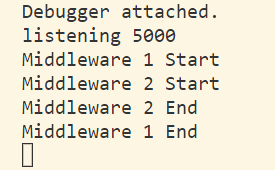

## koa 核心功能样例

```js
const Koa = require('koa');
const app = new Koa();

app.use(async (ctx, next) => {
	console.log('Middleware 1 Start');
	await next();
	console.log('Middleware 1 End');
});

app.use(async (ctx, next) => {
	console.log('Middleware 2 Start');
	await next();
	console.log('Middleware 2 End');

	ctx.body = 'hello, world';
});

app.listen(3000);

// 终端 output:
// Middleware 1 Start
// Middleware 2 Start
// Middleware 2 End
// Middleware 1 End
```

在 koa 官方 blog 上有个非常代表性的中间件 gif 图


## koa 模块

- Application 服务器框架
- Context 框架中各种东东的封装
- MiddleWare 中间件 —— 洋葱模型，应该都听过吧，这个重点看 compose 实现
  > [从 koa-compose 源码中学习如何实现 Promise 链式调用和洋葱模型](https://juejin.cn/post/7117121741356269604)

## 测试

```shell
npm test
```

打开 localhost:5000

终端：

