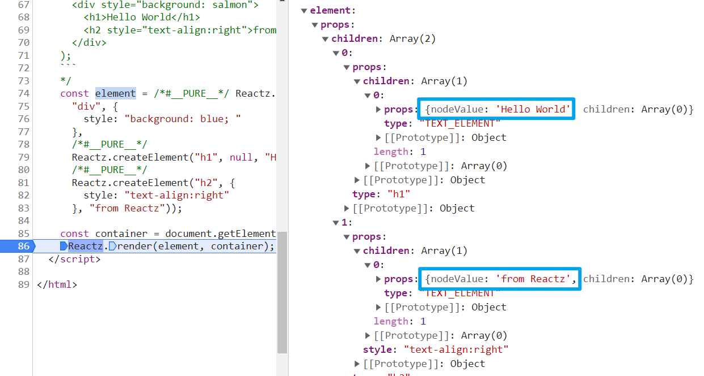
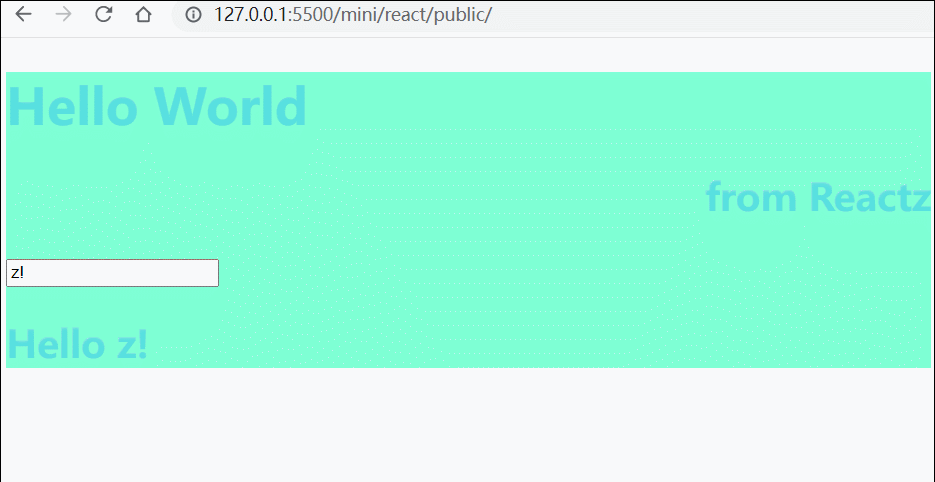
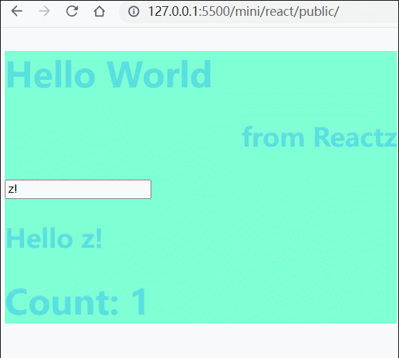

> 我们将一点点按照真实的 React 架构重写 React，同时忽略一些优化和不重要的功能。
> 本文基础部分基于 [build your own React](https://pomb.us/build-your-own-react/)

## 基础的基础

### JSX -> JS

```jsx
const element = <h1 title='foo'>Hello</h1>;
```

一个 JSX 其实就是一个带有 type 和 props 属性或者更多属性的对象

像上面的 JSX 大概就是转换为如此：

```js
// babel 转换为这样
const element = React.createElement('h1', { title: 'foo' }, 'Hello');

// createElement 返回的结果
const element = {
	type: 'h1',
	props: {
		title: 'foo',
		children: 'Hello',
	},
};
```

### render 效果

```jsx
const container = document.getElementById('root');
ReactDOM.render(element, container);
```

转为

```js
const node = document.createElement(element.type);
node['title'] = element.props.title;
//...
container.appendChild(node);
```

## 开始做自己的 React

```js
export default function createElement(type, props, ...children) {
	return {
		type,
		props: {
			...props,
			children: children.map(child =>
				typeof child === 'object' ? child : createTextElement(child)
			),
		},
	};
}

/**
 *
 * @param {string | number} text 基本只
 * @returns 包裹为 type 为特殊类型 TEXT_ELEMENT 的JS对象
 */
function createTextElement(text) {
	return {
		type: 'TEXT_ELEMENT',
		props: {
			nodeValue: text,
			children: {},
		},
	};
}
```

### 小知识：如何让 Babel 把 jsx 转换为 自己的 React.createElement

这里我给自己的 mini-react 取名为 Reactz

所以你可以这样 Babel

```jsx
/** @jsx Reactz.createElement */
const element = (
	<div id='foo'>
		<a>bar</a>
		<b />
	</div>
);
```

这样 Babel 就会把 JSX 编译为 Reactz.createElement

> 但是我是懒狗，连 Babel 都不想搞，直接用 Babel 转之后的代码了，反正这个不是重点辣

### createElement render 代码 & 效果

#### 代码

```js
/* createElement */
function createElement(type, props, ...children) {
	return {
		type,
		props: {
			...props,
			children: children.map(child =>
				typeof child === 'object' ? child : createTextElement(child)
			),
		},
	};
}

/**
 *
 * @param {string | number} text 基本值
 * @returns 包裹为 type 为特殊类型 TEXT_ELEMENT 的JS对象
 */
function createTextElement(text) {
	return {
		type: 'TEXT_ELEMENT',
		props: {
			nodeValue: text,
			children: [],
		},
	};
}

/* ReactDOM.render  */
function render(element, container) {
	//根据 element.type 属性创建 DOM 节点
	const dom =
		element.type === 'TEXT_ELEMENT'
			? document.createTextNode('') //特殊处理 text 节点
			: document.createElement(element.type);

	// element props 给到 dom 除了 children
	const isProperty = key => key !== 'children';
	Object.keys(element.props)
		.filter(isProperty)
		.forEach(name => {
			dom[name] = element.props[name];
		});
	//递归处理子节点
	element.props.children.forEach(child => render(child, dom));
	console.log('!', element.props);
	//将节点加入容器中
	container.appendChild(dom);
}
```

#### 测试代码：

````js
//这里我们省去 Babel 编译的这一步，因为懒得安装了
/*
    ```jsx
    const element = (
      <div style="background: salmon">
        <h1>Hello World</h1>
        <h2 style="text-align:right">from Reactz</h2>
      </div>
    );
    ```
    */
const element = /*#__PURE__*/ Reactz.createElement(
	'div',
	{
		style: 'background: blue; ',
	},
	/*#__PURE__*/
	Reactz.createElement('h1', null, 'Hello World'),
	/*#__PURE__*/
	Reactz.createElement(
		'h2',
		{
			style: 'text-align:right',
		},
		'from Reactz'!
	)
);

const container = document.getElementById('root');
Reactz.render(element, container);
````

效果：

[1666862503741](image/README/1666862503741.png)

## 并发处理

前面已经完成了 JSX 到 DOM 的过程，但是还有一些问题，比如递归处理子节点的地方

```js
element.props.children.forEach(child => render(child, dom));
```

这也是 React 16 之前的问题，一旦开始递归处理，那么在整棵树处理完之前是无法退出的。

这会阻塞主线程很长时间，会带来卡顿的体验，无法给一些高优先级的任务让出时间。

> 高优先级的任务： 用户的输入、点击等操作，动画效果

所以要有一个办法来使得整个任务可以分为多个小块，处理一部分之后先把操作权归还浏览器，让浏览器处理高优先级的任务

> 总体的处理时间是没有变化的，但是体验却好了很多

这里要用到一个浏览器的 API [`requestIdleCallback `](https://developer.mozilla.org/zh-CN/docs/Web/API/Window/requestIdleCallback)，这个方法简单来说就是接收一个回调参数，但是他什么时候执行并不是由你来控制的。而是在浏览器空闲的时候调用。（更多语法详情可以看 MDN ）

> React 并不是用 `requestIdleCallback` 的。
> 它使用自己编写的 [`scheduler package`](https://github.com/facebook/react/tree/main/packages/scheduler) 但两者的效果差不多

> scheduler
> This is a package for cooperative scheduling in a browser environment. It is currently used internally by React, but we plan to make it more generic.
> 这是一个用于浏览器环境中的协作调度的包。它目前在 React 内部使用，但我们计划让它更通用。

## Fiber 数据结构

这个数据结构存在的意义就是为了将所有的任务单元组合起来

每一个 element 都是一个 fiber ，每一个 fiber 都是一个任务单元

每个 fiber 节点主要做三件事：

1. 把 element 添加到 DOM 上
2. 为 fiber 节点的子节点新建 fiber
3. 挑出下一个任务单元

至于怎么找 —— 基础就是他要有三个指针分别指向第一个子节点 child、下一个兄弟节点 sibling、父节点 parent(源码里好像是 return)

一般是先找子节点、没有就兄弟、再没有就去 **父节点的兄弟**，也就是叔叔节点、都没了一直往上，回到 根节点就说明完成了整个树的 render

### 注意区分三个不同的节点实体

#### element

通过 React.createElement 创建的 react element

#### DOM node

通过 React.createDom 中调用 document.createElement 最终生成的 DOM 节点

#### fiber node

就是从 element 到 DOM node 的中间产物，就是用来方便时间切片的

## render & commit

现在发现了一个问题

传入 render 中的 element 是没有问题的



但是渲染出来的效果却少了第二个节点：


少了本该出现在右小角的 from Reactz

这说明我们看到了 **未完全渲染**的 UI

为什么？
因为我们在 performUnitOfWork 中一边遍历 element，一边生成新的 DOM 节点并添加到父节点的 DOM

在整一棵树渲染完成之前，浏览器中途阻断了这个过程 —— 导致我们看到了未完全渲染的 UI，这当然不是我们想要的

> 艹 发现不是这个导致的问题，而是我前面有一个拼写错误导致没渲染出来。之前还给我硬圆回来了，给观众磕一个
> fix:

```js
function performUnitOfWork() {
	//...
	if (nextFiber.sibling) return nextFiber.sibling;
	//...
}
```

```js
function performUnitOfWork(fiber) {
	// add DOM node
	if (!fiber.dom) {
		// 创建 fiber 对应的 DOM 节点
		// 用 fiber.dom 维护创建的 DOM 节点
		fiber.dom = createDom(fiber);
	}
	if (fiber.parent) {
		//添加到父节点的 DOM 上
		fiber.parent.dom.appendChild(fiber.dom);
	}
	//...
}
```

所以现在不要在那里修改 DOM 节点了，将添加 DOM 那部分删除

我们将修改 DOM 的部分记录到 fiber 树上，通过追踪这棵树来收集所有 DOM 节点的修改 —— 这就是 wipRoot(work in progress root)

等完成了 wipRoot 这颗树上的所有任务（next unit of work 为 undefined）时，就将 DOM 树的变更统一一起提交到真实 DOM 树上 —— 通过调用 commitRoot

## 协调 Reconciliation

前面只是添加节点，但我们还需要 更新和删除节点

后两者就需要进行比较了 —— 比较 render 中新拿到的 element 生成的 fiber 树和**上一次提交到 DOM 的 fiber 树**（这玩意就放到 currentRoot 中保存着吧）

而每一个 fiber 节点也需要一个上一个状态的记录 —— 就叫 alternate 吧

为了方便操作，我们要从 performUnitOfWork 中将创建 fiber 节点的代码抽离出来，封装到 reconcileChildren 中

并且在 reconcileChildren 中还会会调和（reconcile）旧的 fiber 节点 和新的 react elements。

迭代 react elements 数组同时迭代旧的 fiber 节点(wipFiber) 比较两者差异，也就是 diff 算法

### 比较

- 新旧节点类型相同 —— 复用旧 DOM，仅修改上面的属性
- 类型不同 —— 创建一个新 DOM 节点，并删除旧节点（如果有旧节点的话）

> key 属性优化协调进程就是它用来检测 elements 中的子组件是否仅仅是更换了位置

并且我们会在 生成的 fiber 上添加一个 effectTag 用来标记更新，这将在 commit 中用到

提交的时候再遍历旧 fiber 树的话非常浪费，不如直接将要删除的 旧 fiber 收集起来放到 deletions 即可。

#### 比较属性

- children 属性例外
- 监听事件 属性例外 （on 开头的）
- 属性更新
- 属性删除

### 测试 & 效果

测试代码

```js
const container = document.getElementById('root');

const updateValue = e => {
	console.log(e.target.value);
	rerender(e.target.value);
	console.log('render');
};

const rerender = value => {
	const inputElement = /*#__PURE__*/ Reactz.createElement(
		'div',
		null,
		/*#__PURE__*/ Reactz.createElement('input', {
			onInput: updateValue,
			value: value,
		}),
		/*#__PURE__*/ Reactz.createElement('h2', null, 'Hello ', value)
	);

	const element = /*#__PURE__*/ Reactz.createElement(
		'div',
		{
			style: 'background: aquamarine; ',
		},
		/*#__PURE__*/
		Reactz.createElement('h1', null, 'Hello World'),
		/*#__PURE__*/
		Reactz.createElement(
			'h2',
			{
				style: 'text-align:right',
			},
			'from Reactz'
		),
		inputElement
	);
	Reactz.render(element, container);
};

rerender('z!');
```

效果：



## 支持函数组件

### jsx -> js

```jsx
function App(props) {
	return <h1>Hi {props.name}</h1>;
}
const element = <App name='foo' />;
```

js:

```js
function App(props) {
	return Reactz.createElement('h1', null, 'Hi ', props.name);
}
const element = Reactz.createElement(App, {
	name: 'foo',
});
```

### 差异

函数组件的 fiber 节点本身没 DOM 节点，而且子节点就是由函数运行得来而不能直接从 props 中获取

所以当 fiber 类型为函数时，还要特殊处理一下

```js
function performUnitOfWork(fiber) {
	const isFunctionComponent = fiber.type instanceof Function;
	if (isFunctionComponent) {
		updateFunctionComponent(fiber);
	} else {
		updateHostComponent(fiber);
	}
	//...
}
```

另外因为函数组件没有 DOM 节点，在寻找父子节点等操作中要跳过

也就是一直找到有 DOM 节点的 fiber 为止

```js
function commitWork(fiber) {
	if (!fiber) return;
	let domParentFiber = fiber.parent;
	while (!domParentFiber.dom) {
		domParentFiber = domParent.parent;
	}
	//...
}
```

删除节点的时候也是同理，抽出来做 commitDeletion

```js
function commitDeletion(fiber, domParent) {
	//找到该 fiber 下第一个有 DOM 节点的 fiber 节点进行删除
	if (fiber.dom) {
		domParent.removeChild(fiber.dom);
	} else {
		commitDeletion(fiber.child, domParent);
	}
}
```

## Hooks

函数组件自身是没办法保存状态的，这个就依赖于 Hook 了

首先我们需要一些全局变量 —— 这是必须的，函数组件自身没法保存状态

所以我们需要在对应的 fiber 节点上加上 hooks 数组存储函数组件中使用的 hook —— 比如记录当前 hook 的序号

当函数组件调用 hook ，我们就检验 fiber 的 alternate，(也就是旧 fiber),检验有没有旧的 hook，hook 的序号就用来记录这是该组件下的第几个 hook

如果没有旧 hook 就直接初始化 state，如果有，就将旧 hook 复制一份到新 hook 里

然后 fiber 上增加新 hook，hookIndex++，最后返回状态

以 useState 为例，它要能更新状态 —— 这依赖于别的方法，可以就叫他 setState，以计数器为例，setState 就接收 自增 state 的方法 作为参数——称为 action

将 action 加入 hook 队列，然后将 wipRoot 设置为当前的 fiber 即可。

剩下交给协调器就好了

```js
function useState(initial) {
	const oldHook =
		wipFiber.alternate &&
		wipFiber.alternate.hooks &&
		wipFiber.alternate.hooks[hookIndex];

	const hook = {
		state: oldHook ? oldHook.state : initial,
		queue: [],
	};
	// 第二次渲染开始就会将所有 action 从旧的 hook 队列中取出
	const actions = oldHook ? oldHook.queue : [];
	// 依次调用 action
	actions.forEach(action => {
		hook.state = action(hook.state);
	});
	const setState = action => {
		hook.queue.push(action);
		wipRoot = {
			dom: currentRoot.dom,
			props: currentRoot.props,
			alternate: currentRoot,
		};
		nextUnitOfWork = wipRoot;
		deletions = [];
	};
	wipFiber.hooks.push(hook);
	hookIndex++;
	return [hook.state, setState];
}
```

### 效果


