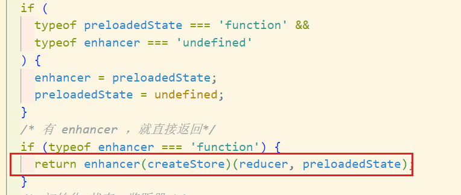
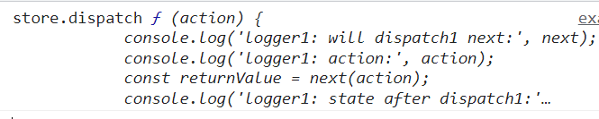
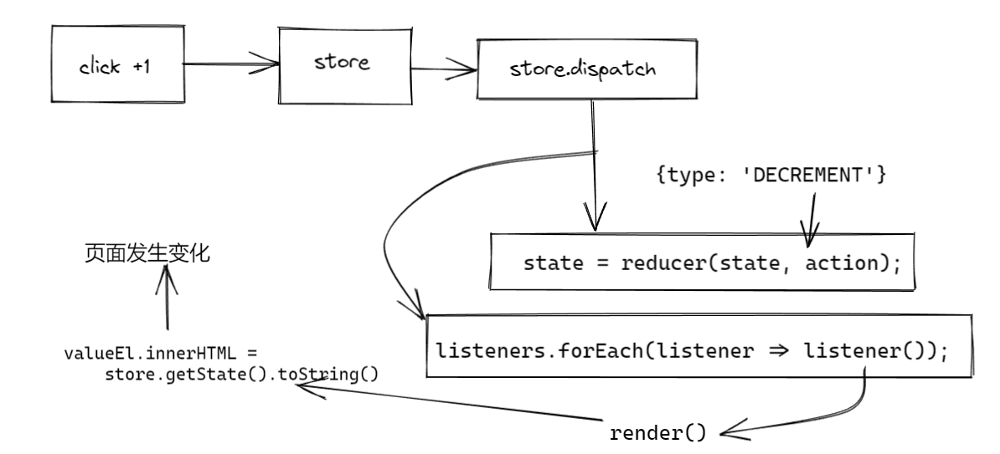
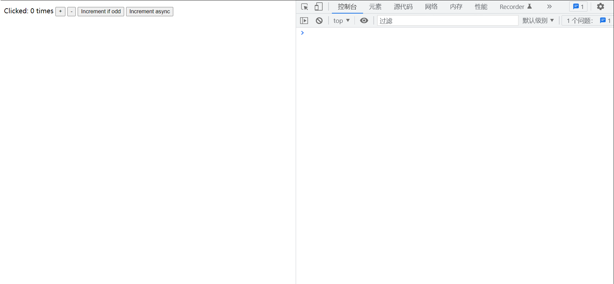
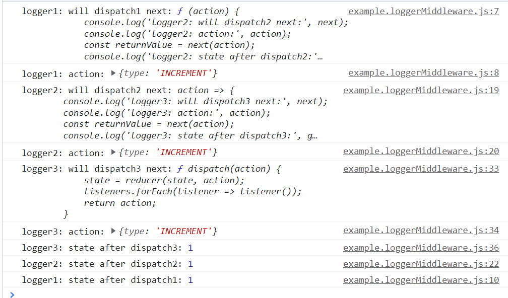

## Redux 简单介绍

要了解函数式编程、高阶函数、纯函数、不可变数据，上手可能难一点。

一个独立的 js 库，可以用于 react、vue，安装相应的包就可

封装的很简单，就是要写很多重复的代码（模板）

与其他常用状态管理库的比较，

- vuex 只能在 vue 中使用

(后面两个还没写)

- recoil
- mobx

## Redux 的几个重点

- applyMiddleware:`ƒ applyMiddleware()`函数是一个增强器，组合多个中间件，最终增强 `store.dispatch` 函数，`dispatch` 时，可以串联执行所有中间件。
- bindActionCreators:`ƒ bindActionCreators(actionCreators, dispatch)`生成 `actions，主要用于其他库，比如` react-redux。
- combineReducers:`ƒ combineReducers(reducers)`组合多个 `reducers`，返回一个总的 `reducer` 函数。
- compose:`ƒ compose()`组合多个函数，从右到左，比如：`compose(f, g, h) `最终得到这个结果 `(...args) => f(g(h(...args))).`
- createStore:` ƒ createStore(reducer, preloadedState, enhancer)` 生成 store 对象

## Redux.createStore 返回的 store 上的方法

- dispatch(action) 派发动作，也就是把 subscribe 收集的函数，依次遍历执行
- subscribe(listener) 订阅收集函数存在数组中，等待触发 dispatch 依次执行。返回一个取消订阅的函数，可以取消订阅监听。
- getState() 获取存在 createStore 函数内部闭包的对象。
- replaceReducer(nextReducer) 主要用于 redux 开发者工具，对比当前和上一次操作的异同。有点类似时间穿梭功能。
- observable()

所以可以直接推测出 核心 API createStore 内部就是创建几个函数后返回一个对象包含这几个函数。类似这样：

```js
return {
	dispatch,
	subscribe,
	getState,
	replaceReducer,
	[$$observable]: observable,
};
```

这里面前三个在 mini 里实现了

### store.dispatch

一顿判断传入的 action 是否合法

然后把收集到的函数依次调用

### store.getState

判断是否正在 dispatch ，是就抛出错误，不是就返回 currentState

### store.subscribe(listener)

订阅监听函数，收集到一个数组`nextListeners`里，dispatch 时调用的函数就来自这

最后返回一个取消监听的函数

## Redux 中间件相关

### Redux.applyMiddleware(...middlewares)

- 传入要用的中间件链
- 返回一个两层函数

在 createStore 中作为第二个参数返回，
createStore 是有对参数类型判断后进行调整的

像这样使用：

```js
var store = Redux.createStore(
	counter,
	Redux.applyMiddleware(logger1, logger2, logger3)
);
```

这个 store 就是增强了 dispatch 方法的 store 对象了

我们看看这样进入 createStore 之后是怎么样



其实 applyMiddleware 就是一个 redux 唯一一个自带的 enhancer

那么 createStore 返回的就是

```js
applyMiddleware(...middleware)(createStore)(reducer, preloadedState);
```

所以 applyMiddleware 要返回啥？

首先它接收 middlewares 之后，返回的第一层是一个接收 createStore 的函数，然后返回第二层函数，第二层函数接收 reducer...等参数，然后返回第三层。

第三层返回的也要和 没传入 enhancer 时的 crateStore 或者说基础版的 createStore 返回的一样，是一个 store。但是这个 store，是 dispatch 强化后的 store~

用强化后的 dispatch 覆盖掉原来的即可

```js
return { ...store, dispatch };
```

#### 怎么强化的 dispatch

首先强化后的 dispatch 肯定还是 dispatch，所以 compose 最后一个就是原来的 store.dispatch

如果传入的 middlewares 是`[a,b,c]`，chain 就是加工后的 middleware，或者说就是已经传入 store 并调用的 middleware，那么强化后的 dispatch 就是 `a2(b2(c2(store.dispatch)))`

a 是长这样的：

```js
function logger1({ getState }) {
	return function (next) {
		return function (action) {
			//...
			const returnValue = next(action);
			//...
		};
	};
}
```

a2 是长这样的，接收 next：

```js
function (next) {
		return function (action) {
			//...
			const returnValue = next(action);
			//...
		};
	};
```

然后 compose

```js
const dispatch = compose(...chain)(store.dispatch);
```

在 compose 后 合起来就是大概这样

```js
a2(b2(c2(store.dispatch)));
```

或者说`store.dispatch`作为`c2`的 next 参数传入，`c2(store.dispatch)`作为`b2`的`next`参数传入...

所以在 a2 中调用 next，就会串联到下一个里面，执行完了原始的 dispatch 后，又一个个的回去 ——形成洋葱模型

#### 中间件的写法

首先，中间件要连成一串，需要一个 next 方法来保证串联 —— 或者说，首位相连就是通过这个保证的，对 next 进行一层层的包装，他自然需要独立一层。compose 完，要的就是强化的 dispatch，是 dispatch 就要接收 action，所以也要在最后一层接收 action 参数。中间件还要可以使用 store 中的东西，比如 getState 和 action，所以 store 要放在顶层

那大概就是这样

```js
function middleware() {
	return ({ getState, dispatch }) => {
		return next => action => {
			return next(action);
		};
	};
}
```

或者说，其实你也可以这么理解，触发 dispatch 之后，就触发了 middleware1、然后 next 到 middleware2...，最后到 dispatch —— 这个就是原始的，没强化的 store.dispatch

输出强化后的 store.dispatch 看看：



他确实就是 第一个中间件 中的第二层函数

```js
function (action) {
  //...
  next(action)
};
```

### Redux.compose

这是一个各大流行库中有使用中间件就有的方法，可以看我 mini-koa 中也有，不过那里的实现方法和这里不太一样

```js
function compose(...fns) {
	if (fns.length === 0) return arg => arg;
	if (fns.length === 1) return fns[0];
	return fns.reduce(
		(a, b) =>
			(...args) =>
				a(b(...args))
	);
}
```

koa 中是递归 dispatch 遍历 + promise，仓库里的 mini-koa 只实现了简单版本，没有 promise

## Redux.combineReducers(reducers)

就是合 reducers 的

---

自己实现的 mini 版本，省略了很多边界的判断，大家可以直接从源码中学习相关的边界，非常细！

## example show

### basic createStore example


按下 +1 后的工程流程


### example.applyMiddleware





可以看到：

- action 是一级一级往下传的
- 第三个中输出的 next 就是原始的 dispatch，最后执行对应 action 的就是原始的 dispatch

整体就是洋葱模型：123 321

---

讲的有点乱，尤其 applyMiddleware 部分。文中用了很多 "或者说"，其实就是我试图换一种表达看看能不能表达的更好，写作水平还望海涵

如果你没看懂，那是我的问题！

你还可以看看这几个：

- (学习 redux 源码整体架构，深入理解 redux 及其中间件原理)[https://github.com/lxchuan12/redux-analysis/#readme]
- (Redux 从设计到源码)[https://tech.meituan.com/2017/07/14/redux-design-code.html]
