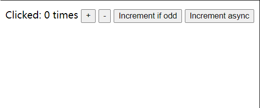

## Redux 简单介绍

要了解函数式编程、高阶函数、纯函数、不可变数据，上手可能难一点。

一个独立的 js 库，可以用于 react、vue，安装相应的包就可

封装的很简单，就是要写很多重复的代码（模板）

与其他常用状态管理库的比较，

- vuex 只能在 vue 中使用

(后面两个还没写)

- recoil
- mobx

## Redux 的几个重点

- applyMiddleware:`ƒ applyMiddleware()`函数是一个增强器，组合多个中间件，最终增强 `store.dispatch` 函数，`dispatch` 时，可以串联执行所有中间件。
- bindActionCreators:`ƒ bindActionCreators(actionCreators, dispatch)`生成 `actions，主要用于其他库，比如` react-redux。
- combineReducers:`ƒ combineReducers(reducers)`组合多个 `reducers`，返回一个总的 `reducer` 函数。
- compose:`ƒ compose()`组合多个函数，从右到左，比如：`compose(f, g, h) `最终得到这个结果 `(...args) => f(g(h(...args))).`
- createStore:` ƒ createStore(reducer, preloadedState, enhancer)` 生成 store 对象

## Redux.createStore 返回的 store 上的方法

- dispatch(action) 派发动作，也就是把 subscribe 收集的函数，依次遍历执行
- subscribe(listener) 订阅收集函数存在数组中，等待触发 dispatch 依次执行。返回一个取消订阅的函数，可以取消订阅监听。
- getState() 获取存在 createStore 函数内部闭包的对象。
- replaceReducer(nextReducer) 主要用于 redux 开发者工具，对比当前和上一次操作的异同。有点类似时间穿梭功能。
- observable()

所以可以直接推测出 核心 API createStore 内部就是创建几个函数后返回一个对象包含这几个函数。类似这样：

```js
return {
	dispatch,
	subscribe,
	getState,
	replaceReducer,
	[$$observable]: observable,
};
```

这里面前三个在 mini 里实现了

### store.dispatch

一顿判断传入的 action 是否合法

然后把收集到的函数依次调用

### store.getState

判断是否正在 dispatch ，是就抛出错误，不是就返回 currentState

### store.subscribe(listener)

订阅监听函数，收集到一个数组`nextListeners`里，dispatch 时调用的函数就来自这

最后返回一个取消监听的函数

## Redux 中间件相关

### Redux.applyMiddleware(...middlewares)

- 传入要用的中间件链
- 返回一个两层函数

在 createStore 中作为第二个参数返回，
createStore 是有对参数类型判断后进行调整的

像这样：

```js
var store = Redux.createStore(counter, Redux.applyMiddleware(logger1, logger2,  logger3))\
```

这个 store 就是增强了 dispatch 方法的 store 对象了

### Redux.compose

这是一个各大流行库中有使用中间件就有的方法，可以看我 mini-koa 中也有，不过那里的实现方法和这里不太一样

koa 中是递归 dispatch 遍历 + promise，仓库里的 mini-koa 只实现了简单版本，没有 promise

## Redux.combineReducers(reducers)

就是合 reducers 的

---

自己实现的 mini 版本，省略了很多边界的判断，大家可以直接从源码中学习相关的边界，非常细！

## example show

### basic createStore example



按下 +1 后的工程流程

