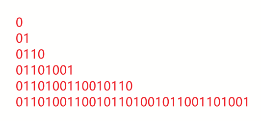

`okkjoo-leetcodeHot-byJs`带你用 JS 刷高频面试算法题~ 每周一更新~ 合集仓库：[okkjoo-leetcodeHot-byJs](https://github.com/okkjoo/okkjoo-leetcodeHot-byJs)
如果你已经按题型分类系统地刷了一遍算法面试题的各个题型，想感受一下面试题的”随机性”的话，欢迎一起~

这是第四周的刷题记录与题解分享

---

# 上题

## [94. 二叉树的中序遍历](https://leetcode.cn/problems/binary-tree-inorder-traversal/)|简单|二叉树入门题

### 题目描述

> 给定一个二叉树的根节点 `root` ，返回 _它的 **中序** 遍历_ 。

### 解题思路

二叉树入门题目

分享一下自己怎么记前中后序遍历是咋样的，前中后，就对应 root 的位置。比如这里的是中序遍历，那就是左节点、root、右节点的顺序。

很简单，递归的时候按顺序来就好了，先左然后处理中，最后右

```js
// @lc code=start
/**
 * Definition for a binary tree node.
 * function TreeNode(val, left, right) {
 *     this.val = (val===undefined ? 0 : val)
 *     this.left = (left===undefined ? null : left)
 *     this.right = (right===undefined ? null : right)
 * }
 */
/**
 * @param {TreeNode} root
 * @return {number[]}
 */
var inorderTraversal = function (root) {
	const res = [];
	const inorder = root => {
		if (!root) return;
		inorder(root.left);
		res.push(root.val);
		inorder(root.right);
	};
	inorder(root);
	return res;
};
```

## [剑指 Offer 10- I. 斐波那契数列](https://leetcode.cn/problems/fei-bo-na-qi-shu-lie-lcof/)|简单|递归|记忆化搜索|dp

### 题目描述

> 写一个函数，输入 n ，求斐波那契（Fibonacci）数列的第 n 项（即 F(N)）。斐波那契数列的定义如下：
>
> > F(0) = 0, F(1) = 1
> > F(N) = F(N - 1) + F(N - 2), 其中 N > 1.
> > 斐波那契数列由 0 和 1 开始，之后的斐波那契数就是由之前的两数相加而得出。
>
> 答案需要取模 1e9+7（1000000007），如计算初始结果为：1000000008，请返回 1。

### 解题思路

#### 递归

一眼看上去，不就是递归就好了，直接按照定义写一个函数开始递归。但是这当然不会考那么简单，很容易发现这里面充满了重复的子问题，多次递归中都会重复计算相同的某个`F(n)`

#### 记忆化

那么我们将重复的直接存下来不就好了，创建一个数组来存储计算过的值。每次需要对应的值时先查找是否计算过，计算过就直接用就好了。没计算过再进行计算

#### dp

然后我们又发现，这个定义不就是 dp 里面的状态转移方程嘛

- `dp[i]`表示其代表 斐波那契 第 i 个数字
- 状态转移方程就是定义
- 初始化 前两个数字就好了
  - 第 0 个就是 0

甚至因为不需要存储以前的数据，实际上只需要三个变量就可以完成了，空间复杂度 O(1)

#### 求余

这里要注意的是，他还说了需要取模，取模其实就是求余~ 他说对结果取模，你可不能真到最后返回结果的时候取模，要在每一步 sum 发生变化的时候取模

### 代码

```js
/**
 * @param {number} n
 * @return {number}
 */
var fib = function (n) {
	let a = 0,
		b = 1,
		c = 0;
	for (let i = 0; i < n; i++) {
		c = (a + b) % 1000000007;
		a = b;
		b = c;
	}
	return a;
};
```

## [104. 二叉树的最大深度](https://leetcode.cn/problems/maximum-depth-of-binary-tree/)|简单|二叉树|递归

### 题目描述

> 给定一个二叉树，找出其最大深度。
>
> 二叉树的深度为根节点到最远叶子节点的最长路径上的节点数。
>
> 说明: 叶子节点是指没有子节点的节点。

### 解题思路

解决二叉树问题最好先想递归方法，真的好使，一个 DFS 就好了

不过可以扩展一下思路，求深度 用 队列来 BFS 也是不错的。

1. 用特殊元素划分每一层
2. 或者在进入下一层之前记录当前队列的长度

### 代码

```js
/**
 * DFS
 * @param {TreeNode} root
 * @return {number}
 */
var maxDepth = function (root) {
	if (!root) return 0;
	if (!root.left && !root.right) return 1;
	return Math.max(maxDepth(root.left), maxDepth(root.right)) + 1;
};
```

```js
/**
 * BFS
 * @param {TreeNode} root
 * @return {number}
 */
var maxDepth = function (root) {
	if (!root) return 0;
	if (!root.right && !root.left) return 1;
	let cur = root;
	const que = [root, null];
	let level = 1;
	while ((cur = que.shift()) !== undefined) {
		if (cur === null) {
			if (que.length === 0) return level;
			level++;
			que.push(null);
			continue;
		}
		cur.left && que.push(cur.left);
		cur.right && que.push(cur.right);
	}
};
```

## [695. 岛屿的最大面积](https://leetcode.cn/problems/max-area-of-island/)|中等|DFS

### 题目描述

> ```
> 给你一个大小为 m x n 的二进制矩阵 grid 。
>
> 岛屿 是由一些相邻的 1 (代表土地) 构成的组合，这里的「相邻」要求两个 1 必须在 水平或者竖直的四个方向上 相邻。你可以假设 grid 的四个边缘都被 0（代表水）包围着。
>
> 岛屿的面积是岛上值为 1 的单元格的数目。
>
> 计算并返回 grid 中最大的岛屿面积。如果没有岛屿，则返回面积为 0
>
> ```

### 解题思路

小岛问题，DFS 遍历图真是太常用了，直接将访问过的小岛置为 0，节省 vis 数组空间

### 代码

```js
/**
 * @param {number[][]} grid
 * @return {number}
 */
var maxAreaOfIsland = function (grid) {
	const d = [
		[1, 0],
		[-1, 0],
		[0, 1],
		[0, -1],
	];
	const m = grid.length,
		n = grid[0].length;
	const dfs = (x, y) => {
		if (x < 0 || y < 0 || x >= m || y >= n || grid[x][y] === 0) return 0;
		grid[x][y] = 0;
		let cnt = 1; //这里从1开始而不是从0..
		for (let i = 0; i < 4; i++) cnt += dfs(x + d[i][0], y + d[i][1]);
		return cnt;
	};
	let res = 0;
	for (let i = 0; i < m; i++)
		for (let j = 0; j < n; j++) {
			res = Math.max(res, dfs(i, j));
		}
	return res;
};
```

## [146. LRU 缓存](https://leetcode.cn/problems/lru-cache/)|设计|哈希表|链表|双向链表

### 题目描述

> 运用你所掌握的数据结构，设计和实现一个 LRU (最近最少使用) 缓存机制 。
>
> 实现 `LRUCache` 类：
>
> - `LRUCache(int capacity)` 以正整数作为容量 `capacity` 初始化 LRU 缓存
> - `int get(int key)` 如果关键字 `key` 存在于缓存中，则返回关键字的值，否则返回 -1 。
> - `void put(int key, int value)` 如果关键字已经存在，则变更其数据值；如果关键字不存在，则插入该组「关键字-值」。当缓存容量达到上限时，它应该在写入新数据之前删除最久未使用的数据值，从而为新的数据值留出空间。
>
> **进阶**：你是否可以在 `O(1)` 时间复杂度内完成这两种操作？

### 解题思路

选择数据结构：

1. 有序，用链表或者数组
2. O(1)的增删——链表，这里干脆上双向链表，方便，也不差这点空间
3. O(1) 的查 —— 哈希表，这里我们直接用 对象就好了

操作：

1. put：检查哈希表，查看是否存在

   1. 存在：
      1. 更新值
      2. 更新其位置到链表头部
         1. 具体更新，就是 remove 了再 append
   2. 不存在，就先检查容量：
      1. 容量不够：
         1. 删除链表尾部节点
         2. 生成新节点到链表头部
      2. 容量未满：
         1. 生成新节点到链表头部

2. get：检查哈希表，查看是否存在
   1. 存在：返回对应的值，并且将其更新位置到链表头部
   2. 不存在：返回-1

### 代码

> 原来题目模板给的原型链形式太难受，为啥不直接上 class？

```js
class _node {
	constructor(key, value) {
		this.key = key;
		this.value = value;
		this.next = null;
		this.prev = null;
	}
}

class LRUCache {
	constructor(capacity) {
		this.capacity = capacity;
		this.mp = {};
		this.size = 0;
		this.head = new _node();
		this.tail = new _node();
		this.head.next = this.tail;
		this.tail.prev = this.head;
	}

	get(key) {
		let node = this.mp[key];
		if (node == null) return -1;
		this.remove(node);
		this.append(node);
		return node.value;
	}

	put(key, value) {
		let node = this.mp[key];
		if (node == null) {
			if (this.size == this.capacity) {
				let tail = this.removeTail();
				delete this.mp[tail.key];
				this.size--;
			}
			let newNode = new _node(key, value);
			this.mp[key] = newNode;
			this.append(newNode);
			this.size++;
		} else {
			node.value = value;
			this.remove(node);
			this.append(node);
		}
	}

	remove(node) {
		let pre = node.prev;
		let nxt = node.next;
		pre.next = nxt;
		nxt.prev = pre;
	}
	//默认就加到队头
	append(node) {
		node.prev = this.head;
		node.next = this.head.next;
		this.head.next.prev = node;
		this.head.next = node;
	}

	removeTail() {
		let tail = this.tail.prev;
		this.remove(tail);
		return tail;
	}
}

/**
 * Your LRUCache object will be instantiated and called as such:
 * var obj = new LRUCache(capacity)
 * var param_1 = obj.get(key)
 * obj.put(key,value)
 */
```

## [剑指 Offer 22. 链表中倒数第 k 个节点](https://leetcode.cn/problems/lian-biao-zhong-dao-shu-di-kge-jie-dian-lcof/)|简单|链表|双指针

### 题目描述

> 输入一个链表，输出该链表中倒数第 k 个节点。为了符合大多数人的习惯，本题从 1 开始计数，即链表的尾节点是倒数第 1 个节点。
>
> 例如，一个链表有 6 个节点，从头节点开始，它们的值依次是 1、2、3、4、5、6。这个链表的倒数第 3 个节点是值为 4 的节点。

### 解题思路

经典快慢指针就好了，先让快指针先走 k 步，然后慢指针再开始走。（都是一个一个走）当快指针到达链表尾节点，慢指针就到倒数第 k 个节点了

### 代码

```js
/**
 * Definition for singly-linked list.
 * function ListNode(val) {
 *     this.val = val;
 *     this.next = null;
 * }
 */
/**
 * @param {ListNode} head
 * @param {number} k
 * @return {ListNode}
 */
var getKthFromEnd = function (head, k) {
	let fast = head,
		slow = head;
	while (k--) {
		fast = fast.next;
	}
	while (fast) {
		fast = fast.next;
		slow = slow.next;
	}
	return slow;
};
```

## [209. 长度最小的子数组](https://leetcode.cn/problems/minimum-size-subarray-sum/)|中等|滑动窗口|双指针

### 题目描述

> 给定一个含有 n 个正整数的数组和一个正整数 target 。
>
> 找出该数组中满足其和 ≥ target 的长度最小的 连续子数组 [numsl, numsl+1, ..., numsr-1, numsr] ，并返回其长度。如果不存在符合条件的子数组，返回 0 。

### 解题思路

连续子数组 + 和 大于 target，想想滑动窗口~

先让右边界右移，当总和大于 target，就收缩左边界看看总和还能不能大于 target

注意更新 最短长度的时机

以及 right 指针的遍历范围

时间复杂度 O(n)，空间复杂度 O(1)

### 代码

```js
/*
 * @lc app=leetcode.cn id=209 lang=javascript
 *
 * [209] 长度最小的子数组
 */

// @lc code=start
/**
 * @param {number} target
 * @param {number[]} nums
 * @return {number}
 */
var minSubArrayLen = function (target, nums) {
	if (nums.length === 0) return 0;
	let left = 0,
		right = 0,
		len = 0;
	let cnt = 0,
		ans = 0;
	for (; right < nums.length + 1; right++) {
		//注意这里 right 要跑到 length，不然最后一步会不收缩左边界
		while (cnt >= target) {
			if (ans === 0 || len < ans) {
				ans = len;
			}
			cnt -= nums[left++];
			len--;
		}
		len++;
		cnt += nums[right];
	}
	return ans;
};
// @lc code=end
```

## [42. 接雨水](https://leetcode.cn/problems/trapping-rain-water/)|困难| 双数组|双指针|

### 题目描述

> 给定 `n` 个非负整数表示每个宽度为 `1` 的柱子的高度图，计算按此排列的柱子，下雨之后能接多少雨水。

### 解题思路

> 之前学校天梯赛选拔就出了这题...当时没 ac...唉，要是当时写出来了，说不定现在还在研究算法竞赛，就还没开始彻底开始前端之路哈哈

要求下雨后能装多少水，有坑的地方才能装水嘛

#### 暴力思路

一个 x 坐标能接多少水，要看自己的高度 `height[x]`，以及左右两侧柱子中最大值中的较小的那个值。（有点绕，可以结合题目中的图理解一下）

也就是：

- 能接的水 = 水位 - 自己的高度
- 自己的高度 = 题目给的 height
- 水位 = min(leftMax, rightMax)

那你暴力遍历每个坐标也还需要这两个值... 所以还要数组存一下 `leftMax` 和 `rightMax`...

#### 双数组

那就先用数组存下来

> 下面会更新为双指针节省空间

`leftMax[i]`就表示 i 左边的最高柱子的高度，leftMax 就从左边开始遍历， rightMax 就从右边开始遍历

时间复杂度 O(n)，空间复杂度 O(n)。

#### 双指针

看代码就会发现，遍历了三次，左边一次，右边一次，累积和起来一次

那能不能把左右一次合在一起？也就是说，前面我们是一次遍历算一个柱子，双指针，我们一次直接算两个柱子接的水。

两个柱子一起，也是和前面一样，要知道两个柱子左右两边最大值的较小值。

让两个柱子分别为 i、j。就会有

- ileftMax
- irightMax
- jleftMax
- jrightMax

假设 j > i，那么 j 就在 i 的右边，那么肯定的：

- jleftMax >= i leftMax
- irhgtMax >= jRightMax

> 前面说一次直接算两个柱子可能有点误解，或许应该说是 一次遍历中 两边柱子轮流接水

具体怎么轮流？

取决于哪个自身的高度比较矮，比如 i 比较矮，那就是接 i ，水位取哪一个？取 ileftMax。j 也一样

也就是 要维护的两个变量 ileftMax jrightMax 。双指针 i、j，从两头向中间走就好了

> 官方题解里的 leftMax 就是最左边的 —— ileftMax，rightMax 就是最右边的 jrightMax
>
> 可能这时候看解释还是有点绕 我也不知道怎么表达比较好.. 但是看代码然后结合官方题解里的动画应该能理解

时间复杂度 O(n)，空间复杂度 O(1)

> 其他解法都是时间复杂度为 O(n)，空间复杂度为 O(n)，这里就不学了

### 代码

双数组

```js
var trap = function (height) {
	let ans = 0;
	const leftMax = [],
		rightMax = [];
	let tmx = 0; //临时记录当前最高柱子
	for (let i = 0; i < height.length; i++) {
		leftMax[i] = tmx = Math.max(tmx, height[i]);
	}
	tmx = 0;
	for (let i = height.length - 1; i >= 0; i--) {
		rightMax[i] = tmx = Math.max(tmx, height[i]);
	}
	for (let i = 0; i < height.length; i++) {
		ans += Math.min(leftMax[i], rightMax[i]) - height[i];
	}
	return ans;
};
```

双指针

```js
var trap = function (height) {
	let ans = 0,
		i = 0,
		j = height.length - 1,
		ileftMax = 0,
		jrightMax = 0;
	while (i < j) {
		ileftMax = Math.max(ileftMax, height[i]);
		jrightMax = Math.max(jrightMax, height[j]);
		if (height[i] < height[j]) {
			ans += ileftMax - height[i];
			i++;
		} else {
			ans += jrightMax - height[j];
			j--;
		}
	}
	return ans;
};
```

## 779. 第 K 个语法符号

### 题目描述

```js
我们构建了一个包含 n 行( 索引从 1  开始 )的表。首先在第一行我们写上一个 0。接下来的每一行，将前一行中的0替换为01，1替换为10。

例如，对于 n = 3 ，第 1 行是 0 ，第 2 行是 01 ，第3行是 0110 。
给定行数 n 和序数 k，返回第 n 行中第 k 个字符。（ k 从索引 1 开始）
```

### 解题思路

稍微自己模拟几次，就会发现一点规律


每一行的后半部分就是前半部分的反转，而前半部分就是上一行

那么求第 k 个，如果 k 在后半部分，其实就是求 k 前半部分对应位置字符 k2 的反转，求 k 前半部分对应的反转，其实就是求 k2 前半部分对应的反转...

- k > (n-2)/2 就是在后半部分
  - 大于就取前半部分对应的位置 k - (n - 2)/2 上的反转 ^
- 否则就是直接的第 k 个

递归！

终止就是第一个位置肯定是 0

### 代码

```js
/**
 * @param {number} n
 * @param {number} k
 * @return {number}
 */
var kthGrammar = function (n, k) {
	if (k === 1) return 0;
	if (k > 1 << (n - 2)) return 1 ^ kthGrammar(n - 1, k - (1 << (n - 2)));
	return kthGrammar(n - 1, k);
};
```
